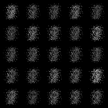
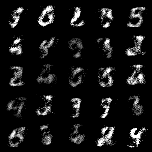
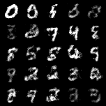

# Generative Adversarial Nets

This repository is implemented by Pytorch.

[NIPS 2014]

**GAN**: [Paper](https://papers.nips.cc/paper/5423-generative-adversarial-nets.pdf) | [Blog](https://kh-mo.github.io/generative-model/2019/05/03/generative_adversarial_nets/)

## Result

All results are randomly sampled.

*Epoch 1* | *Epoch 10* | *Epoch 25*
:---: | :---: | :---: |
 |  | 

## Loss

 *Description* |*Value Function* |
:---: | :---: |
Generator Loss |  |
Discriminator Loss |  |

## Getting Start
### Download data
- Download in current space
- Input : MNIST URL
- Output : raw_data folder, MNIST file
```shell
python dataset_download.py \
    --download_path = .
```

### Preprocessing
- training_set = {60000 * 28 * 28 size, 0-255 value, 0-9 label}, test_set = {10000 * 28 * 28 size, 0-255 value, 0-9 label} 
- Input : raw_data folder, MNIST file
- Output : preprocess folder, train.pt, test.pt
```shell
python preprocessing.py
```

### modeling
- Input : preprocess folder, train.pt
- Output : saved_image folder, images_per_epoch, saved_model folder, generator model, discriminator model
```shell
python modeling.py \
    --batch_size = 64
    --epochs = 25
    --latent_z_dim = 100
```

### evaluating
- Input : saved_model folder, generator model, discriminator model
- Output : evaluated_image folder, eval_images
```shell
python evaluating.py \
    --num_images = 2
```